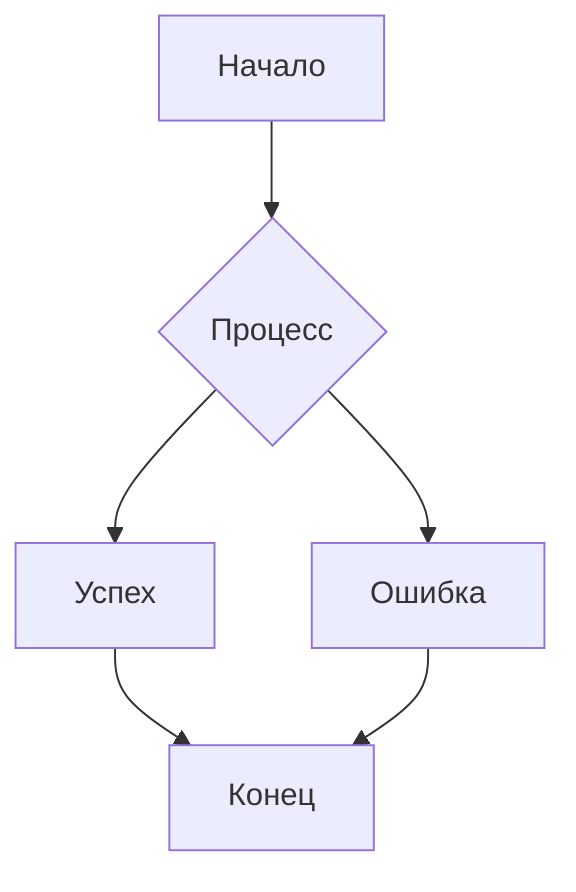

# cor
# Сапевари — Сайт о грузинской кухне


## Описание проекта

**Сапевари** — это интерактивный веб-сайт, посвященный богатой и самобытной кухне Грузии. Проект предназначен для всех любителей вкусно поесть, путешественников, планирующих поездку в Грузию, и просто curious minds, желающих познакомиться с культурой через ее гастрономию.

**Основные функции:**
 **Каталог блюд:** Удобная галерея с описанием самых популярных грузинских блюд (хачапури, хинкали, сациви и др.).
   **Поиск и фильтрация:** Поиск блюд по названию и фильтрация по категориям (выпечка, мясо, супы, соусы).
 **Избранное:** Возможность добавлять понравившиеся рецепты в избранное для быстрого доступа.
 **Адаптивный дизайн:** Сайт корректно отображается на всех устройствах: от смартфонов до десктопов.

 Установка и запуск

Чтобы запустить проект у себя локально, выполните следующие шаги:

1.  **Клонируйте репозиторий:**
    ```bash
    git clone https://github.com/your-username/inoskekbn.git
    ```
2.  **Перейдите в директорию проекта:**
    ```bash
    cd sapevari-cuisine
    ```
3.  ** Если используется vs code **

      **С помощью расширения для VS Code,** например, "Live Server".

4.  **Откройте браузер:**
    Перейдите по адресу `http://localhost:8000` .

## Примеры использования

### Выбор блюда

1.  Найдите поле поиска в верхней части страницы.
2.  Введите название блюда, например, "хачапури".
3.  Список блюд автоматически отфильтруется.


### Просмотр галереи блюд

1.  Наведите курсор на карточку с понравившимся блюдом.
2.  Нажмите на значок картинку.
3.  Блюдо будет выбрано и пояавится описание.

** пример кода**
 <article class="menu-category">
                <h3>Десерты</h3>
                <article class="menu-item">
                    <div class="menu-item-content">
                        <h4>Чурчхела</h4>
                        <p>Традиционная грузинская сладость из орехов в виноградном соке</p>
                    </div>
                    <span>280 руб.</span>
                </article>
                <article class="menu-item">
                    <div class="menu-item-content">
                        <h4>Пеламуши</h4>
                        <p>Десерт из виноградного сока и кукурузной муки</p>
                    </div>
                    <span>240 руб.</span>
                </article>
            </article>
        </section>

        <section id="gallery">
            <h2>Галерея</h2>
            <div class="gallery-container">
                <figure class="gallery-item">
                    
                    <figcaption>Интерьер нашего ресторана</figcaption>
                </figure>
                <figure class="gallery-item">
                    
                    <figcaption>Наши фирменные блюда</figcaption>
                </figure>
                <figure class="gallery-item">
                    
                    <figcaption>Уютная атмосфера</figcaption>
                </figure>
                <figure class="gallery-item">
                    
                    <figcaption>Хачапури по-грузински</figcaption>
                </figure>
                <figure class="gallery-item">
                    
                    <figcaption>Наш повар за работой</figcaption>
                </figure>
                <figure class="gallery-item">
                    
                    <figcaption>Традиционные десерты</figcaption>
                </figure>
                <figure class="gallery-item">
                    
                    <figcaption>Наши лучшие блюда</figcaption>
                </figure>
                <figure class="gallery-item">
                    
                    <figcaption>Праздничный стол</figcaption>
                </figure>
            </div>
        </section>

        <section id="video">
            <h2>Видео о нашем ресторане</h2>
            <div class="video-container">
                <iframe src="/36/img/mixkit-cooking-meat-balls-in-sauce-3806-hd-ready.mp4" title="Видео о ресторане грузинской кухни" allow="accelerometer; autoplay; clipboard-write; encrypted-media; gyroscope; picture-in-picture" allowfullscreen></iframe>
            </div>
            <p>Посмотрите, как мы готовим наши фирменные блюда и ощутите атмосферу настоящей Грузии!</p>
        </section>

        <section id="reservation">
            <h2>Забронировать стол</h2>
            <form>
                <div class="form-group">
                    <label for="name">Ваше имя</label>
                    <input type="text" id="name" name="name" required>
                </div>
                <div class="form-group">
                    <label for="phone">Телефон</label>
                    <input type="tel" id="phone" name="phone" required>
                </div>
                <div class="form-group">
                    <label for="date">Дата</label>
                    <input type="date" id="date" name="date" required>
                </div>
                <div class="form-group">
                    <label for="time">Время</label>
                    <input type="time" id="time" name="time" required>
                </div>
                <div class="form-group">
                    <label for="guests">Количество гостей</label>
                    <input type="number" id="guests" name="guests" min="1" max="20" required>
                </div>
                <div class="form-group">
                    <label for="comments">Особые пожелания</label>
                    <textarea id="comments" name="comments"></textarea>
                </div>
                <button type="submit">Отправить заявку</button>
            </form>
        </section>

        <section id="contacts">
            <h2>Контакты</h2>
            <div class="contact-info">
                <article class="address">
                    <h3>Адрес</h3>
                    <p>г. Москва, ул. Арбат, 25</p>
                </article>
                <article class="hours">
                    <h3>Часы работы</h3>
                    <p>Пн-Чт: 11:00 - 23:00</p>
                    <p>Пт-Сб: 11:00 - 01:00</p>
                    <p>Вс: 11:00 - 23:00</p>
                </article>
                <article class="phone">
                    <h3>Телефон</h3>
                    <p>+7 (495) 123-45-67</p>
                </article>
            </div>
            <div class="map-container">
                <iframe src="https://www.google.com/maps/embed?pb=!1m18!1m12!1m3!1d2245.3729490453885!2d37.59541631604675!3d55.75202300015199!2m3!1f0!2f0!3f0!3m2!1i1024!2i768!4f13.1!3m3!1m2!1s0x46b54a45b11de355%3A0x8947e447a3b4c893!2z0JDRgNCx0LvRj9C0!5e0!3m2!1sru!2sru!4v1652103913171!5m2!1sru!2sru" allowfullscreen="" loading="lazy"></iframe>
            </div>
        </section>
    </main>
README
    Техническая документация проекта "Сапевари"

Статус: На рассмотрении

1. Введение
1.1. Назначение проекта
"Сапевари" — это интерактивная веб-платформа, посвященная богатой и разнообразной грузинской кухне. Проект создается с целью сохранения и популяризации кулинарных традиций Грузии через современные цифровые технологии. Платформа объединяет в себе функции кулинарной энциклопедии, социальной сети для любителей кулинарии и практического помощника в приготовлении аутентичных грузинских блюд. В эпоху глобализации, когда традиционные рецепты могут терять свою аутентичность, "Сапевари" служит цифровым хранителем кулинарного наследия, обеспечивая доступ к проверенным рецептам и традиционным техникам приготовления для самой широкой аудитории.

1.2. Область применения
Изначально проект разрабатывается как образовательная платформа в рамках учебного курса по веб-разработке, однако благодаря тщательно продуманной архитектуре и ориентированности на пользователя, он имеет все предпосылки для превращения в полноценный коммерческий проект. Платформа может быть использована кулинарными школами для обучения грузинской кухне, ресторанами для разработки меню, а также обычными пользователями для повседневного приготовления блюд. Особую ценность проект представляет для грузинской диаспоры по всему миру, помогая сохранять кулинарные традиции вдали от родины.

1.3. Целевая аудитория
Целевая аудитория проекта охватывает широкий спектр пользователей с различными потребностями и уровнем кулинарной подготовки. Это и профессиональные повара, ищущие аутентичные рецепты; и домохозяйки, желающие разнообразить семейное меню; и студенты, осваивающие основы кулинарии; и туристы, желающие воспроизвести понравившиеся блюда после посещения Грузии; и представители грузинской диаспоры, стремящиеся сохранить кулинарные традиции. Особое внимание уделяется новичкам в грузинской кухне, которым необходимы пошаговые инструкции и объяснение специфических техник приготовления.

2. Техническое задание
2.1. Функциональные требования
2.1.1. Модуль рецептов
Система должна предоставлять пользователям доступ к обширной базе рецептов грузинской кухны с возможностью удобной навигации по категориям (первые блюда, вторые блюда, выпечка, соусы и т.д.). Каждый рецепт должен содержать детальное описание, список ингредиентов с возможностью конвертации мер, пошаговые инструкции с фотографиями, информацию о времени приготовления и сложности. Система оценок и отзывов позволит пользователям делиться своим опытом приготовления и помогать другим в освоении рецептов.

2.1.2. Интерактивный конструктор меню
Уникальный модуль конструктора поможет пользователям создавать сбалансированные меню  — от семейного ужина до традиционного грузинского застолья (супра). Система будет учитывать сочетаемость блюд, сезонность продуктов, временные затраты на приготовление и пищевые предпочтения. Пользователи смогут сохранять готовые меню, делиться ими с другими и адаптировать под конкретное количество гостей.

2.1.3. Система пользователей и сообщества
Многоуровневая система пользователей позволит зарегистрированным участникам создавать личные кулинарные книги, сохранять понравившиеся рецепты, вести дневник приготовлений и общаться с другими участниками сообщества. Система достижений и наград мотивирует пользователей к активному участию в жизни платформы. Эксперты грузинской кухни смогут получить статус проверенных авторов.

2.1.4. Магазин ингредиентов и кухонной утвари
Интегрированный модуль поможет пользователям находить специализированные грузинские продукты и традиционную кухонную утварь в их регионе. Система будет предлагать альтернативы для труднодоступных ингредиентов и предоставлять информацию о их заменителях.

2.2. Нефункциональные требования
Производительность платформы критически важна для удобства пользователей — время загрузки страниц не должно превышать 2 секунд. Адаптивный дизайн должен обеспечивать безупречное отображение на всех типах устройств, от смартфонов до настольных компьютеров. Особое внимание уделяется доступности контента для пользователей с ограниченными возможностями. Система должна быть оптимизирована для SEO чтобы обеспечить максимальный охват аудитории, интересующейся грузинской кухней.

3. Архитектура системы
3.1. Общая структура
Архитектура проекта построена по микросервисной модели, что обеспечивает гибкость и масштабируемость системы. Клиентская часть реализована на современном фреймворке Vue.js, серверная часть использует Node.js с Express, а для хранения данных применяется комбинация PostgreSQL для структурированных данных  для пользовательского контента.

text

3.2. Frontend архитектура

Основные компоненты:

RecipeExplorer - компонент для поиска и фильтрации рецептов

RecipeDetail - детальное отображение рецепта с интерактивными шагами

MenuBuilder - конструктор меню с визуальным редактором

UserCookbook - личная кулинарная книга пользователя

IngredientFinder - поиск ингредиентов и заменителей

3.3. Backend архитектура
Технологический стек:
Серверная часть построена на микросервисной архитектуре с использованием Node.js и Express.js. Каждый микросервис отвечает за определенную бизнес-область. Аутентификация реализована через JWT-токены, для кэширования используется Redis, а для обработки изображений — Sharp.

Микросервисы:

javascript
/services
 
  /user-service         // Пользователи и аутентификация
  /search-service       // Полнотекстовый поиск
  /image-service        // Обработка и хранение изображений

3.4. База данных
Структура данных:


users - пользователи и их профили

menus - сохраненные меню пользователей


cooking_sessions - сессии приготовления

 **4. API документация**
 **4.1. Базовый URL и общая информация**
Веб-сервис "Сапевари" предоставляет RESTful API, построенное по принципам ресурсно-ориентированной архитектуры. 


**4.2. Основные endpoints и их функциональность**


**Пользователи — управление персональными данными**
Модуль пользователей обеспечивает всю функциональность, связанную с управлением учетными записями, аутентификацией и персональными данными.

```javascript
POST   /auth/register     # Регистрация нового пользователя с валидацией
POST   /auth/login        # Аутентификация пользователя
GET    /users/profile     # Получение полного профиля пользователя
PUT    /users/profile     # Обновление информации в профиле
```

**Меню — конструктор гастрономических композиций**
Модуль меню предоставляет инструменты для создания сбалансированных гастрономических композиций, учитывающих множество факторов.

```javascript
POST   /menus             # Создание нового меню с автоматической валидацией
GET    /menus             # Получение списка меню пользователя с фильтрацией
GET    /menus/:id         # Детальное получение информации о меню
POST   /menus/generate    # Генерация меню по заданным параметрам
```


---

 **5. Модели данных**

**5.1. Рецепт (Recipe) — сердце кулинарной платформы**
Модель рецепта представляет собой сложную структуру, предназначенную для хранения всей необходимой информации о кулинарном блюде — от базового описания до детальных технических параметров приготовления. Каждый рецепт тщательно категоризируется и тегируется для обеспечения эффективного поиска и фильтрации.

```javascript
{
  // Основная информация о рецепте
  title: String,          # Название рецепта на русском и грузинском языках
  description: String,    # Детальное описание блюда и его особенностей
  category: String,       # Категория: супы, основные блюда, закуски, выпечка
  difficulty: String,     # Уровень сложности приготовления
  
  
  // Метаданные и системная информация
  images: [String],       # Галерея изображений готового блюда
  author: ObjectId,       # Автор рецепта
  rating: Number,         # Средний рейтинг от пользователей
  tags: [String],         # Теги для улучшения поиска
  createdAt: Date         # Дата создания рецепта
}
```
 **5.2. Пользователь (User) — центральная сущность системы**
Модель пользователя объединяет функциональность учетной записи, персональных предпочтений, социального взаимодействия и кулинарной статистики. Система разработана для обеспечения максимальной персонализации и создания уникального пользовательского опыта.

```javascript
{

  
  // Персональный профиль
  profile: {
    firstName: String,    # Имя пользователя
    lastName: String,     # Фамилия пользователя
    avatar: String,       # Аватар профиля
    cookingLevel: String  # Уровень кулинарной подготовки
  },
  

  
  // Персональные настройки
  preferences: {
    newsletter: Boolean,     # Подписка на рассылку новых рецептов
    language: String,        # Предпочитаемый язык интерфейса
    measurementSystem: String # Метрическая или имперская система
  },
  
```

 **5.3. Меню (Menu) — гастрономическая композиция**
Модель меню представляет собой набор рецептов, организованных для конкретного мероприятия с учетом традиционных грузинских принципов составления застолья.

```javascript
{
  // Основная информация о меню
  title: String,             # Название меню
  description: String,       # Описание мероприятия
  occasion: String,          # Повод: повседневное, праздничное, супра
  season: String,            # Сезон для учета сезонных продуктов
  
  // Состав меню - последовательность блюд
  dishes: [{
    recipeId: ObjectId,      # Ссылка на рецепт
    servingTime: String      # Время подачи: закуска, основное, десерт
  }],
  
  // Практическая информация для приготовления
  timing: {
    totalPreparation: Number, # Общее время подготовки
    totalCooking: Number      # Общее время приготовления
  },
  
  // Информация о создателе и доступности
  author: ObjectId,          # Автор меню
  isPublic: Boolean,         # Доступно ли меню другим пользователям
  createdAt: Date            # Дата создания меню
}
```

---

 **6. Конструктор меню**
 **6.1. Интеллектуальный алгоритм составления меню**
Алгоритм конструктора меню представляет собой сложную систему, сочетающую правила грузинской кулинарной традиции с современными технологиями. Система анализирует множество факторов для создания сбалансированных и аутентичных гастрономических композиций, учитывающих как технические параметры, так и культурные особенности.

```javascript
function createMenu(occasion, guests, preferences) {
  // Анализ параметров мероприятия и гостей
  const menuParams = analyzeOccasion(occasion, guests);
  
  // Подбор блюд по категориям с учетом предпочтений
  const appetizers = selectAppetizers(menuParams, preferences);
  const mainCourses = selectMainCourses(menuParams, preferences);
  const desserts = selectDesserts(menuParams, preferences);
  
  // Комплексная проверка сочетаемости блюд
  const compatibility = checkDishCompatibility(appetizers, mainCourses, desserts);
  
  // Формирование итогового меню с дополнительной информацией
  return {
    dishes: combineDishes(appetizers, mainCourses, desserts),
    compatibilityScore: compatibility.score,
    totalTime: calculateTotalPreparationTime(appetizers, mainCourses, desserts),
    shoppingList: generateShoppingList(appetizers, mainCourses, desserts, guests),
    nutritionalInfo: calculateNutritionalBalance(appetizers, mainCourses, desserts)
  };
}
```

 **6.2. Многоэтапный процесс создания идеального меню**
Этап 1: Определение цели и параметров мероприятия
Процесс начинается с глубокого анализа целей и особенностей планируемого мероприятия. Система проводит детальный опрос пользователя, выясняя ключевые параметры: тип события (повседневный ужин, праздничное застолье, традиционная супра, романтический ужин или семейное торжество), количество приглашенных гостей, их возрастные категории и гастрономические предпочтения. Особое внимание уделяется выявлению диетических ограничений и аллергий среди гостей, культурным особенностям и традициям, которые следует учесть. На этом этапе также определяется бюджет мероприятия и доступное время для подготовки, что позволяет системе оптимизировать подбор блюд согласно реальным возможностям пользователя.

Этап 2: Выбор гастрономической концепции
На основе собранной информации система предлагает несколько тематических направлений для меню. Пользователь может выбрать между аутентичным региональным меню, сфокусированным на кулинарных традициях конкретного региона Грузии (Кахетия, Имеретия, Мегрелия, Аджария), или современной интерпретацией классических блюд. Система предоставляет подробные описания каждой концепции, включая историческую справку, характерные ингредиенты и особенности подачи. Для помощи в выборе демонстрируются примеры готовых меню и отзывы других пользователей, уже опробовавших подобные гастрономические маршруты.


Этап 3: Подбор основных блюд
Основные блюда составляют сердцевину грузинского застолья. Система обеспечивает белковое разнообразие, предлагая комбинацию мясных, рыбных и овощных блюд. Алгоритм анализирует совместимость вкусовых профилей, избегая конфликта ароматов и обеспечивая гармоничное восприятие всей композиции. Учитывается культурная аутентичность — подбираются блюда, традиционно сочетающиеся в грузинской кухне. Система предлагает как известные хичины (шашлык, чанахи, чашушули), так и менее распространенные региональные специалитеты, способные удивить гостей своей оригинальностью

6.6. Пользователь (User)
javascript
{
  _id: ObjectId,
  username: {type: String, required: true, unique: true},
  email: {type: String, required: true, unique: true},
  password: {type: String, required: true},
  profile: {
    firstName: String,
    lastName: String,
    avatar: String,
    bio: String,
    location: String,
    cookingLevel: {type: String, enum: ['beginner', 'intermediate', 'advanced', 'expert']},
    dietaryPreferences: [String]
  },
  statistics: {
    recipesCooked: {type: Number, default: 0},
    recipesCreated: {type: Number, default: 0},
    reviewsWritten: {type: Number, default: 0},
    menusCreated: {type: Number, default: 0}
  },
  
6.7. Меню (Menu)
javascript
{
  _id: ObjectId,
  title: {type: String, required: true},
  description: String,
  occasion: {type: String, enum: ['everyday', 'holiday', 'supra', 'romantic', 'family']},
  season: {type: String, enum: ['spring', 'summer', 'autumn', 'winter']},
  dishes: [{
    recipeId: {type: ObjectId, ref: 'Recipe', required: true},
    servingTime: {type: String, enum: ['appetizer', 'first', 'main', 'dessert']},
    notes: String,
    order: Number
 
7. Конструктор меню
7.1. Алгоритм составления меню
javascript
function generateMenu(userPreferences, occasion, guestsCount, dietaryRestrictions) {
  const menu = {
    appetizers: [],
    mainCourses: [],
    sides: [],
    desserts: []
  };
  
  // Подбор закусок
  const appetizers = await Recipe.find({
    category: 'appetizer',
    difficulty: { $lte: userPreferences.maxDifficulty },
    preparationTime: { $lte: userPreferences.maxPrepTime },
    'ingredients.ingredientId': { $nin: dietaryRestrictions.forbiddenIngredients }
  }).limit(3);
  
 
  
  // Проверка сочетаемости блюд
  const compatibilityScore = calculateCompatibility(menu);
  
  
  return {
    menu,
    compatibilityScore,
    totalPreparationTime: calculateTotalTime(menu),
    dietaryWarnings: checkDietaryWarnings(menu, dietaryRestrictions)
  };
}
7.2. Процесс создания меню


Выбор основных блюд - баланс мяса, рыбы, овощей

Добавление гарниров и соусов - традиционные сочетания

Завершение десертами - легкие или традиционные сладости


# Внешние API

8. Тестирование
8.1. Функциональное тестирование
Тестирование процесса создания рецепта

Проверка работы конструктора меню

Тестирование системы поиска и фильтрации

Проверка пользовательских сценариев

8.2. Интеграционное тестирование
Тестирование

Проверка взаимодействия микросервисов

Тестирование интеграции с внешними API

Проверка работы с базами данных

8.3. Пример тест-кейса
javascript
describe('Recipe Creation Flow', () => {
  it('should create a new recipe with all required fields', async () => {
    const recipeData = {
      title: 'Хачапури по-аджарски',
      category: 'main',
      difficulty: 'medium',
      preparationTime: 90,
      cookingTime: 30,
      servings: 4,
      ingredients: [
        { name: 'мука', quantity: 500, unit: 'г' },
        { name: 'сулугуни', quantity: 400, unit: 'г' }
      ],
      steps: [
        { order: 1, instruction: 'Замесить тесто' },
        { order: 2, instruction: 'Приготовить начинку' }
      ]
    };
  
});
9. Развертывание и запуск
9.1. Production сборка
bash
# Frontend
npm run build

# Backend
npm run build
npm start


Заключение
Проект "Сапевари" представляет собой современную цифровую платформу для сохранения и популяризации богатого кулинарного наследия Грузии. Благодаря продуманной архитектуре и ориентированности на пользователя, проект имеет значительный потенциал для роста и развития. Документация будет регулярно обновляться по мере реализации новых функций и развития проекта.

Контактная информация:

Разработчик: [Багомедова Сабина Алиевна]

Электронная почта: [bagomedovaSA23@icloud.com]


Версия документации: 1.0


[html-ccs-main (3).zip](https://github.com/user-attachments/files/23818859/html-ccs-main.3.zip)
